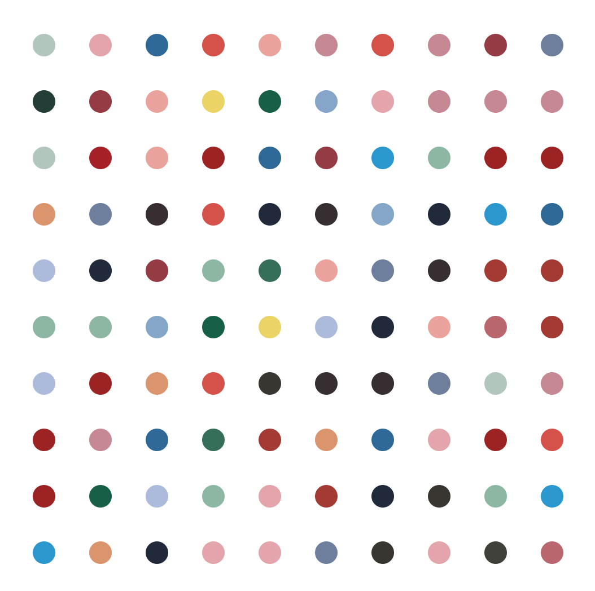

# Hirst's Spot Painting using Turtle

Painting Hirst's Spot Painting using Turtle module. 

1. Grab 20 most common colors on Hirst's original painting.
2. Use a Turtle object to paint 10x10 colorful spots

